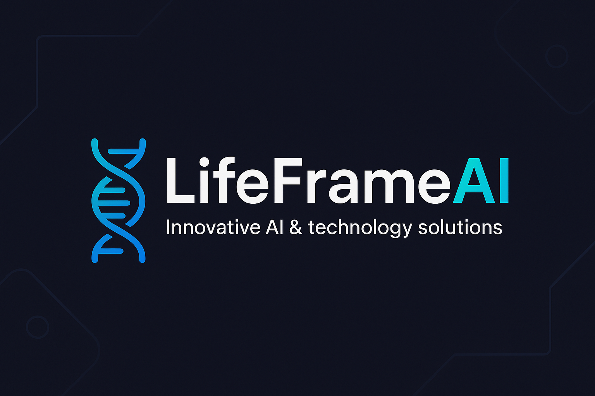

# 🧬 LifeFrameAI

**LifeFrameAI** is an innovative technology company specializing in the development of intelligent, scalable systems for enterprises and government agencies.  
We combine **Artificial Intelligence**, **Automation**, and **System Integration** to deliver tailor-made, future-proof solutions.

---

## 🚀 Services & Expertise
- **AI Development** – Language models, context-based assistants, machine learning.
- **Automation** – End-to-end automation of complex business processes.
- **System Integration** – Connecting and harmonizing existing systems and platforms.
- **Security Solutions** – Data protection–compliant architectures for sensitive information.

---

## 🌟 Vision
To create technology that **understands**, **decides**, and **supports** – not just reacts.  
LifeFrameAI stands for **custom, intelligent solutions** that generate sustainable value.

---

## 📂 Project Portfolio (Highlights)
- **ALISE** – Artificial Lifeform for Integrated Sentient Evolution.  
- **CAP** – Context Awareness Protocol for dynamic, context-driven AI behavior and seamless integration with external systems.

---

## 🛠 Core Technologies

---

## 📫 Contact
  
  

---

> © 2025 LifeFrameAI – All rights reserved.
